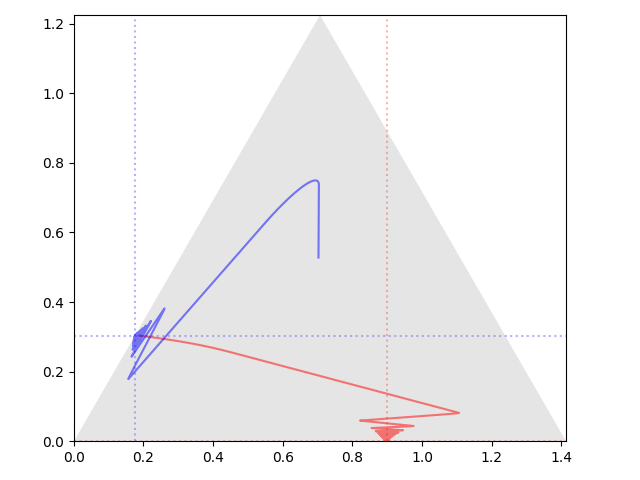
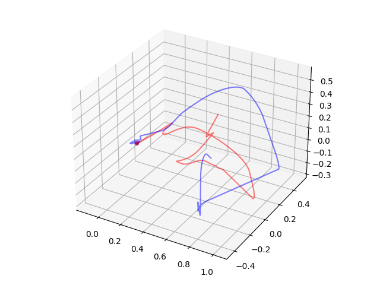
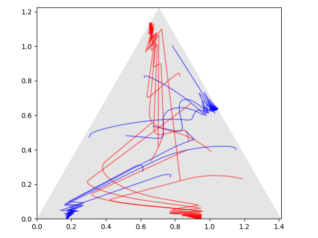
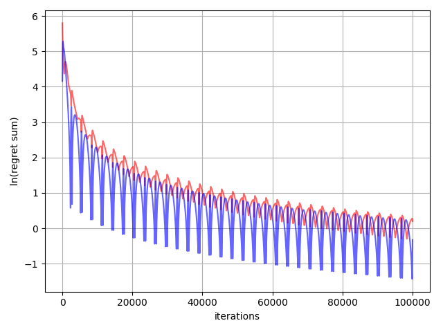
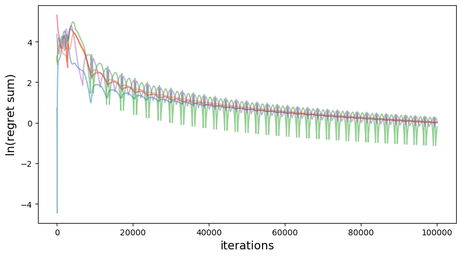

# A path finder for Nash equilibrium
## Overview
This project provides many demo programs to show that the non-cooperative games always converges to Nash equilibrium no matter what initial strategy is given.
The convergence path can be nicely visualized in the 2-D or 3-D graph.

More math details are in [this paper](https://arxiv.org/abs/1908.09021).

## Requirements
***
* Python 3
* Python packages: numpy, matplotlib, scikit-learn, nashpy(optional)

Note: Numpy with Openblas support will greatly improves performance. See this [link](https://stackoverflow.com/questions/27199822/numpy-dot-is-slow-yet-blas-and-lapack-are-installed-how-to-fix).

## Demos for two-person games
***
Find the strategy path to Nash equilibrium for a 3X3 game.
```
python eqpt_trajectory_3x3.py 3x3_two_eqpt_two_support_2
```
Here ***3x3_two_eqpt_two_support_2*** is the code name of a 3X3 game, which is defined the python file `games/3x3_two_eqpt_two_support_2.py`. This game has two equilibrium points each of which uses two pure strategies.
The output figure shows that the strategy path goes to one of the equilibrium point dependent on what initial strategies the game starts with:



Note that the red and blue paths belong to different players for the same equilibrium point.

Or you can run a game with random bimatrix and random initial strategies.
```
python eqpt_trajectory_3x3.py 3x3
```
Here game ***3x3*** is defined in `games/3x3.py`. In fact, you can define any game by creating a new Python file in the `games` directory. The following games with self-explanatory file names are predefined:


You can of course run any general mXn game and show the path in 3-D graph. Note that the path of mXn dimensions is reduced to 3x3 with PCA. Here is an example of 60x40 game:
```
python eqpt_trajectory_PCA_3D.py 60x40
```
Game ***60x40*** is defined in file `games/60x40.py`. Here is the output figure showing the path:



You can run even bigger game, e.g. `games/300x200_two_hour_laptop.py`, which costs less than two hours for a laptop to run.

And equilibrium point can be an 'attractor' for strategy paths, meaning that equilibrium point is the inevitable destination of game regardless where it starts. You can run:
```
python tunnel_3x3.py 3x3_two_eqpt_two_support_2
```
The output figure shows that the paths always go to one of the two equilibrium points.



Each time you run the game, there is text output in the terminal showing the details about the equilibrium point and its approximation accuracy.

The accuracy of approximating to a Nash equilibrium point can be visualized by running:
```
python eqpt_trajectory_VGS.py 3x3_two_eqpt_two_support_2
```
The output figure is




## Demos for many-person games
And you can run many-person game, which usually takes time. The many-person games are defined in the `FPI_nP.py` file. Its visualization of path has yet to be provided. Here is the command:
```
python FPI_nP.py
```
Its approximating proces can visualized though, as follows:


